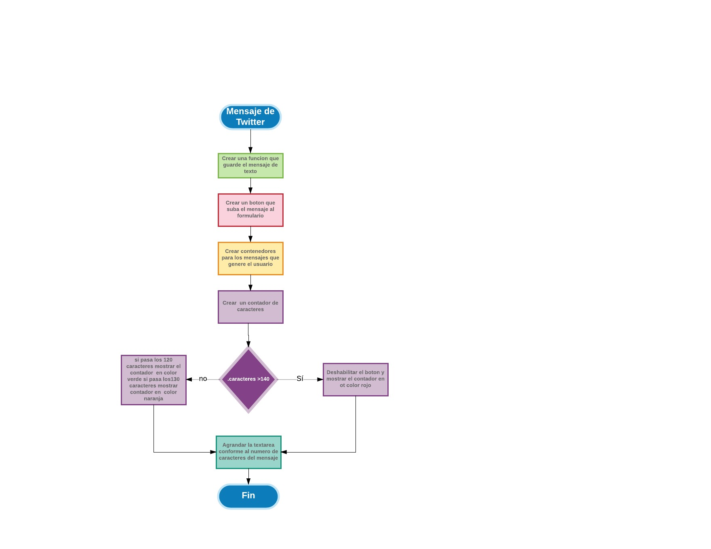

# Twitter

## Instrucciones

### Versión 0.0.1

Diseñar un formulario que permita ingresar un texto y un botón para "twittear".
Agregar un evento de click al botón o de submit al formulario.
En el evento, obtener el texto.
Agregar el texto al HTML.

### Versión 0.0.2

No ingresar texto vacío (deshabilitar el botón de "twittear").
Contar la cantidad de caracteres de forma regresiva.

### Versión 0.0.3

Si pasa los 140 caracteres, deshabilitar el botón.
Si pasa los 120 caracteres, mostrar el contador con OTRO color.
Si pasa los 130 caracteres, mostrar el contador con OTRO color.
Si pasa los 140 caracteres, mostrar el contador en negativo.

### Versión 0.0.4

Al presionar enter(/n) que crezca el textarea de acuerdo al tamaño del texto.

### Versión 0.0.5 (Extra)

Si la cantidad de caracteres ingresados (sin dar un enter), supera al tamaño del textarea por defecto, debe de agregarse una línea más para que no aparezca el scroll. (Si en caso aplica)

### Versión 0.0.6 (Extra)

Agregar la hora en que se publicó el tweet. En el formato de 24 horas: hh:mm.
Nota: Para dar formato a la fecha y hora, puedes crear tu propia función o usar una librería como moment.js.

## Pseudo-código

--------------------------------------------

1. Maquetar el sitio en HTML con las distintas secciones que requiere indentando correctamente para comprender las relaciones entre cada elemento.

2. Insertar íconos.

3. Dar estilo con el archivo .css realizando comentarios y haciendo uso de buenas prácticas, ordenando por etiquetas, id´s y clases.

4. Generar la interacción con JS:
  4.1 Crear una funcion que guarde el mensaje de texto que genere el usuario.
  4.2 Crear un boton para que al hacer click suba el mensaje al formulario.
  4.2 Crear contenedores para los mensajes que genere el usuario
  4.3 Crear un contador de caracteres a travez de la funcion var counterCharacter que inicie en cero y guarde la longitud de la cadena para...
    4.3.1. Identificar cuantos caracteres a ingresado el usuario en el textarea, si:
        Si pasa los 140 caracteres, deshabilitar el botón y mostrar el contador
        de caracteres en otro color.
        Si pasa los 120 caracteres, mostrar el contador con OTRO color.
        Si pasa los 130 caracteres, mostrar el contador con OTRO color.
  4.4. Agrandar la textarea conforme al numero de caracteres que contenga el mensaje de texto.

5. Crear elementos en base a la estrutura del HTML.
  5.1. Darle atributos a los elementos creados.

##Diagrama de Flujo

